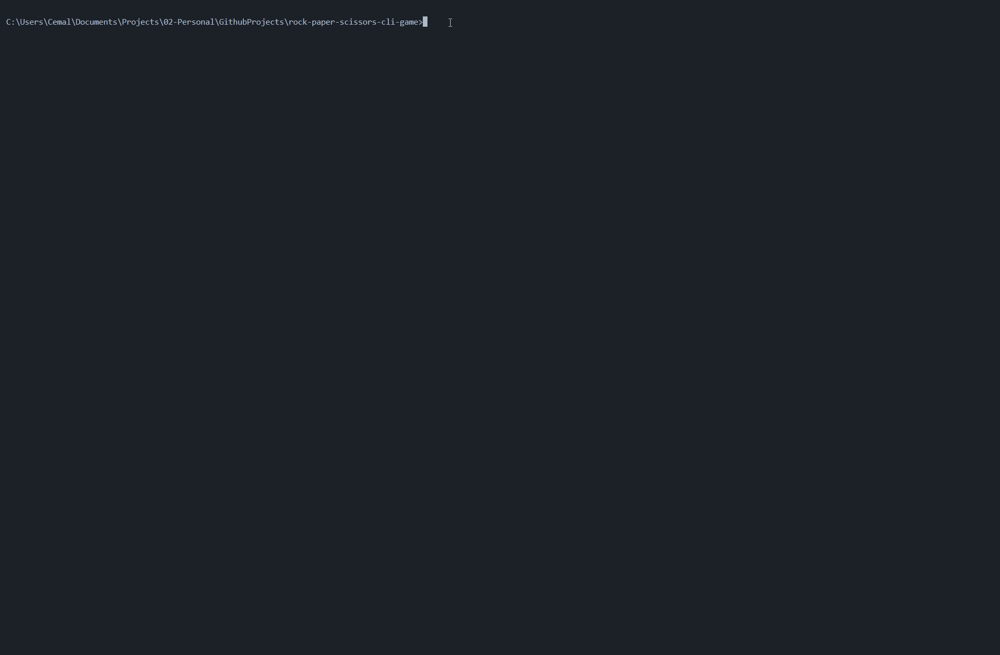

# The Rock Paper Scissors Python CLI Game

Merhaba, bu repoda Udemy'deki 100 Days of Code eğitiminin 4. gününde geliştirilen Taş Kağıt Makas oyununun Python becerileri ile genişletilmiş bir versiyonunu bulabilirsiniz. Eğitimde anlatılan akıştan farklı olarak uygulama ürün bazlı olarak geliştirilmiştir. Eğitime sağ tarafta bulunan adresten ulaşabilirsiniz.

## Uygulama Amacı

Geliştirilen uygulamadaki amaç terminal üzerinden alınan 0-2 arasındaki değere göre Taş-Kağıt-Makas oyunun sonucunu döndürmektir. Uygulamanın kullanımını aşağıdaki hareketli görselden takip edebilirsiniz.

## Geliştirme Kartı

### Diller ve Paketler

- Python 3.10

### Teknik Beceriler

- Modüler Programlama
- Kullanıcı Tanımlı Hata Yönetimi

## Yapılacaklar Listesi

- [x] Oyun algoritmasının geliştirilmesi
- [x] Taş, Kağıt, Makas terminal görsellerinin eklenmesi
- [x] Kullanıcı tercihine bağlı olarak uygulamanın sürekli çalıştırılması 
- [x] Çalışmanın modüler hale getirilmesi
- [ ] Skor sisteminin geliştirilmesi
